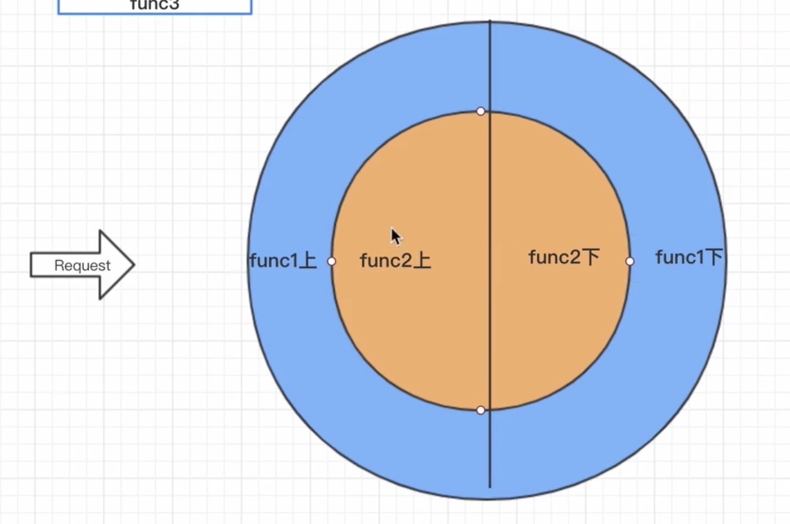

### KOA精简特性与二次开发必要性
---
* 洋葱圈模型,精简,不好用
* 定制化能力越强
* 硬撸 代码啰嗦

### KOA的中间件
---
中间件其实就是函数，中间件函数返回的是一个promise对象

```
const Koa = require('koa');

// 应用程序对象 中间件
const app = new Koa()

// 发送HTTP KOA 接收HTTP
// 注册中间件
app.use(async (ctx, next)=> {
    // 上下文  下一个中间件函数
    const a = await next();
    // 求值关键字 表达式 仅仅promise 阻塞当前线程
    console.log(a)
})
app.use(async (ctx, next)=> {
    const axios = require('axios');
    const res = await axios.get('http://talelin.com')
    await next()
})

app.listen(3000)

```
### 洋葱模型
---
中间件函数前要加async(async返回的是一个包装好的promise函数)，next()前要加await（await可以理解为求值关键字，不仅可以跟promise，还可以求出表达式的值,也会阻塞当前线程）
Q:中间件函数前为什么加async？
A:配合await使用，保证洋葱模型顺利执行
```
await 100*100
```


* 如何第n个中间件函数返回数据到第一个中间件函数
将要返回的数据添加再`ctx`上
```
app.use(async (ctx, next)=> {
    // 上下文  下一个中间件函数
    await next();
    console.log(ctx.r)
})
app.use(async (ctx, next)=> {
    const axios = require('axios');
    const res = await axios.get('http://talelin.com')
    ctx.r = res;
    await next()
})
```