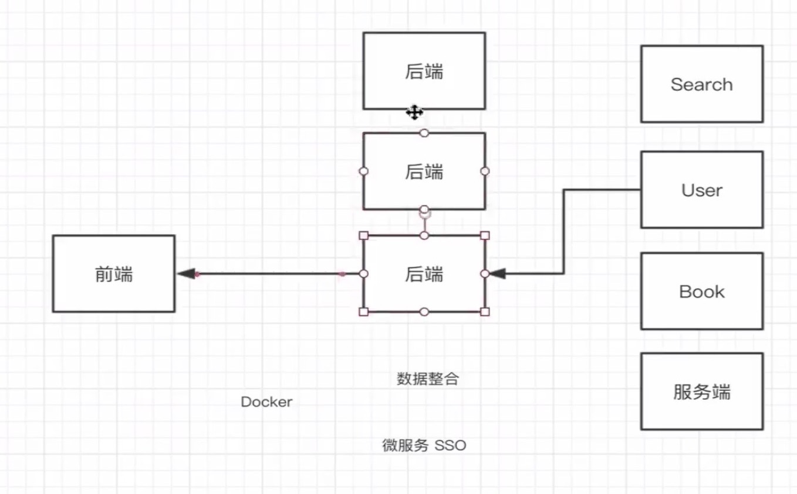

1. 函数是去干某件事，是一个过程，不能保存状态，可以用class来实现
2. 注意this的指向，可以用bind来绑定

type： {
[表达式]:1
}

3. 面向对象：设计实例方法
4. 设计静态方法更多偏向面向过程
5. 项目的开放封闭原则(封闭修改 开放扩展)

6. 高并发
* 并行：同一时间
* 宏任务 微任务：实现并发
* Cpu密集型 资源密集型

7. 微服务sso:解决性能问题、或者业务复杂也可以做成微服务
中间层其实就是从服务端取完数据，整合成前端需要的结构

8. Json序列化控制
如果要返回指定的字段给前端，可以加toJSON方法，这个方法不能传递参数，不过可以通过this.getDataValue()来获取相应的属性值，在island中，我们从数据库取完数据，赋值给ctx.body,在这里会对返回值做一次序列化，所以我们可以修改toJSON方法来改写返回的值